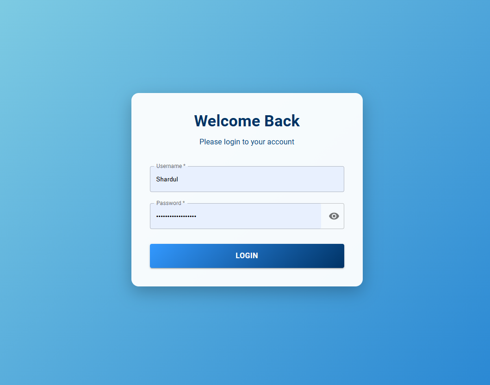
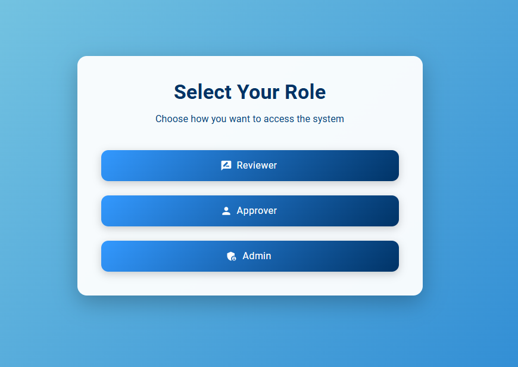
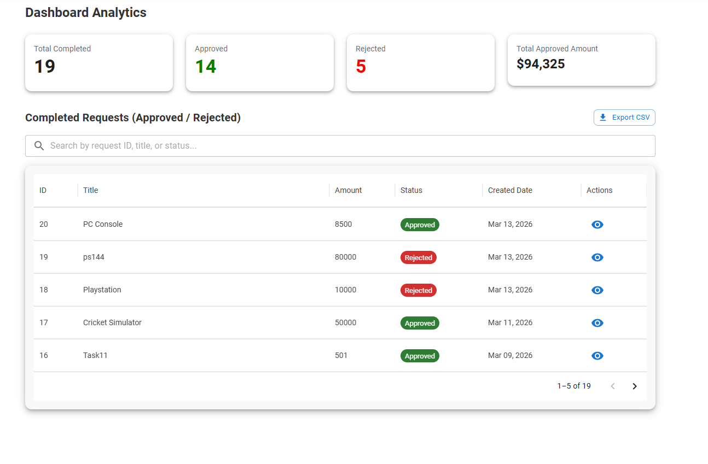
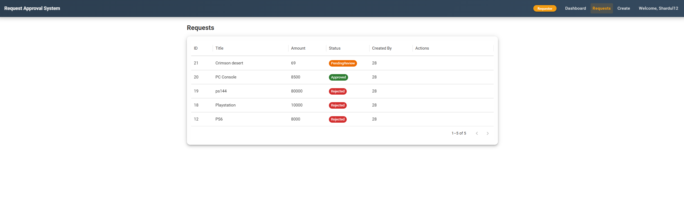
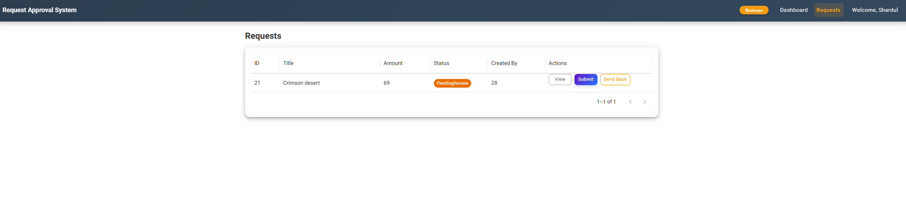
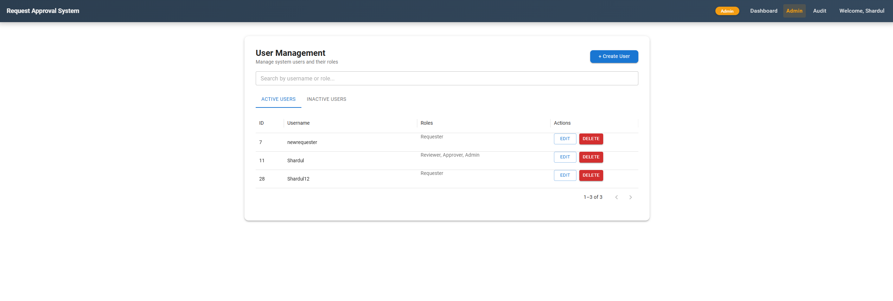
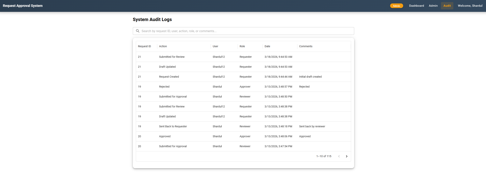

# Request Approval System

A full-stack web application for managing multi-step request approvals with role-based access control, JWT authentication, and a complete audit trail.

---

## Screenshots

### Login Page


### Role Selection Page


### Dashboard


### Request Page (Requester)
This page displays all requests created by the logged-in user. The action column is empty when there are no draft requests requiring attention.



### Request Page (Reviewer)
Displays only requests currently assigned to the Reviewer role that are pending review.



### Admin Page


### Audit Page


---

## Tech Stack

**Backend**
- ASP.NET Core 8 Web API
- Entity Framework Core + SQL Server
- JWT Bearer Authentication
- Role-based Authorization

**Frontend**
- React 18 + TypeScript
- Material UI (MUI v6)
- Axios
- React Router v6
- MUI DataGrid

---

## How the Workflow Works

```
Requester → creates a Draft request
         → submits it for Review

Reviewer  → reviews the request
         → either sends it back to Requester (with comments)
         → or submits it for Approval

Approver  → either Approves or Rejects the request (with comments)

Admin     → manages users, roles, and views all audit logs
```

Every action is recorded in an audit log — who did what and when.

---

## Features

- JWT authentication with inactivity timeout (5 min) and warning modal
- Role-based navigation — users with multiple roles can switch between them
- Full audit trail per request with username and timestamp
- Admin panel — create, edit, soft-delete, and reactivate users
- Password policy enforced on both frontend (live checklist) and backend
- CSV export of completed requests from the Dashboard
- Inline form validation on all inputs
- Global exception middleware — consistent JSON error responses
- Change password with current password verification

---

## Project Structure

```
/
├── Shar_RequestApproval.API/        # .NET backend
│   ├── Controllers/                 # API endpoints
│   ├── Services/                    # Business logic
│   ├── DTOs/                        # Request/response models
│   ├── Exceptions/                  # Custom exception types
│   ├── Middleware/                  # Global error handling
│   └── Models/                      # EF Core entities
│
└── request-approval-client/         # React frontend
    ├── src/
    │   ├── components/              # Reusable UI components
    │   ├── pages/                   # Page-level components
    │   ├── auth/                    # AuthContext, ProtectedRoute
    │   ├── requests/                # ActionButton, CreateRequest, RequestDetails, RequestList
    │   └── utils/                   # exportCsv, passwordPolicy
```

---

## Getting Started

### Prerequisites

- [.NET 8 SDK](https://dotnet.microsoft.com/download)
- [Node.js 18+](https://nodejs.org/)
- SQL Server (local or Azure)

### 1. Clone the repo

```bash
git clone https://github.com/YOUR_USERNAME/request-approval-system.git
cd request-approval-system
```

### 2. Set up the backend

Copy the example config and fill in your values:

```bash
cd Shar_RequestApproval.API
cp appsettings.example.json appsettings.json
```

Open `appsettings.json` and update:

```json
{
  "ConnectionStrings": {
    "DefaultConnection": "Your SQL Server connection string here"
  },
  "Jwt": {
    "Key": "your-secret-key-minimum-32-characters",
    "Issuer": "https://localhost:7294",
    "Audience": "http://localhost:5173"
  }
}
```

Run database migrations:

```bash
dotnet ef database update
```

Start the API:

```bash
dotnet run
```

API will be available at `https://localhost:7294`  
Swagger UI at `https://localhost:7294/swagger`

### 3. Set up the frontend

```bash
cd request-approval-client
npm install
npm run dev
```

Frontend will be available at `http://localhost:5173`

> **Note:** If your API runs on a different port, update `baseURL` in `src/api/axios.ts`

### 4. Seed initial data

Run the following SQL to create the default roles:

```sql
INSERT INTO Roles (Name) VALUES ('Admin'), ('Requester'), ('Reviewer'), ('Approver');
```

Then register your first Admin user via the `/api/auth/register` endpoint (use Swagger).

---

## Default Roles

| Role | What they can do |
|------|-----------------|
| Requester | Create, edit, and submit requests |
| Reviewer | Review submitted requests, send back or forward to Approver |
| Approver | Approve or reject requests pending approval |
| Admin | Manage users and view all system audit logs |

---

## API Endpoints (summary)

| Method | Endpoint | Role | Description |
|--------|----------|------|-------------|
| POST | `/api/auth/login` | Public | Login |
| POST | `/api/auth/register` | Public | Register |
| POST | `/api/auth/change-password` | Authenticated | Change password |
| GET | `/api/requests` | Authenticated | Get requests for active role |
| POST | `/api/requests` | Requester | Create draft |
| PUT | `/api/requests/{id}` | Requester | Update draft |
| POST | `/api/requests/{id}/submit` | Requester | Submit for review |
| POST | `/api/requests/{id}/send-back` | Reviewer | Send back to requester |
| POST | `/api/requests/{id}/submit-approval` | Reviewer | Forward to approver |
| POST | `/api/requests/{id}/approve` | Approver | Approve request |
| POST | `/api/requests/{id}/reject` | Approver | Reject request |
| GET | `/api/requests/completed` | Authenticated | List completed requests |
| GET | `/api/requests/{id}/audit` | Authenticated | Audit log for a request |
| GET | `/api/admin/users` | Admin | List all users |
| POST | `/api/admin/create` | Admin | Create user |
| PUT | `/api/admin/{id}` | Admin | Update user |
| DELETE | `/api/admin/{id}` | Admin | Soft delete user |
| PUT | `/api/admin/reactivate/{id}` | Admin | Reactivate user |
| GET | `/api/admin/audit` | Admin | All system audit logs |

---

## Known Limitations / Future Improvements

- No refresh tokens (JWT expires after 2 hours — user must re-login)
- No email notifications when a request changes status
- No rate limiting on login endpoint
- No unit tests yet

---

## License

MIT